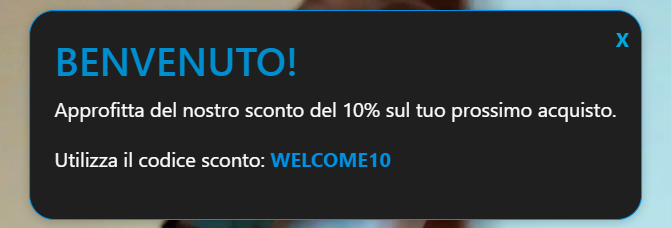
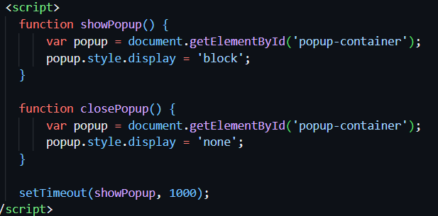
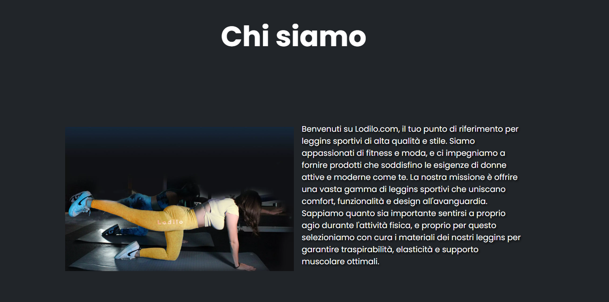
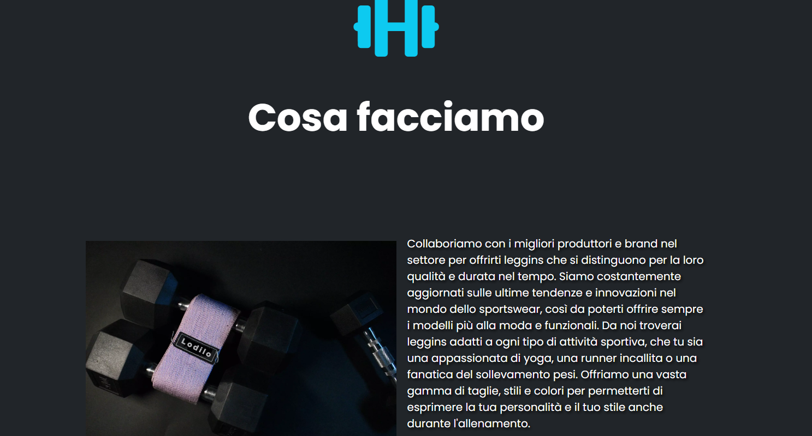
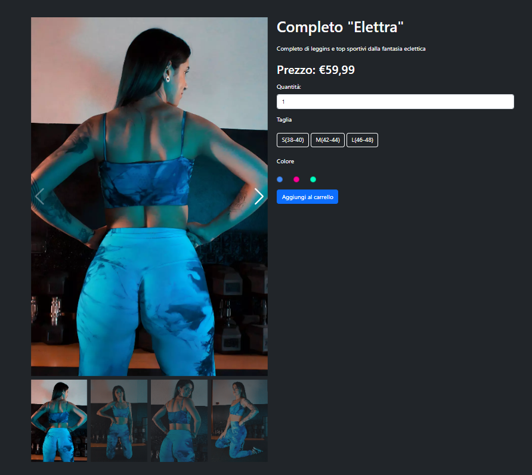
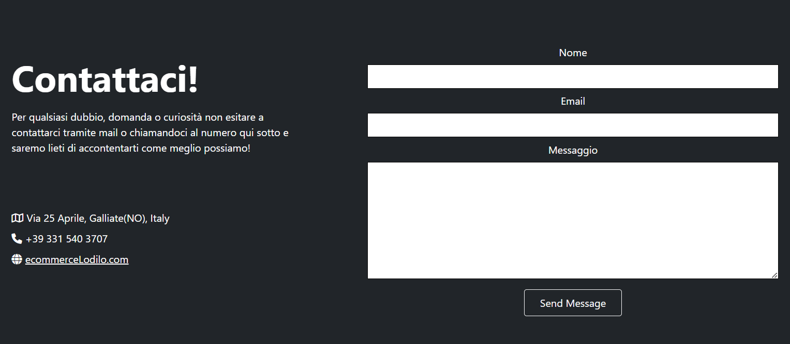
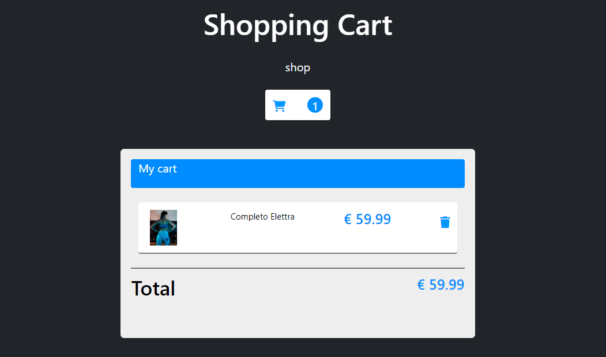
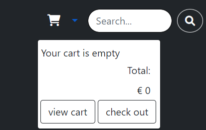
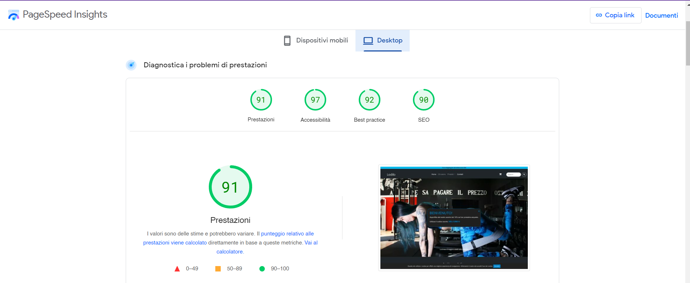
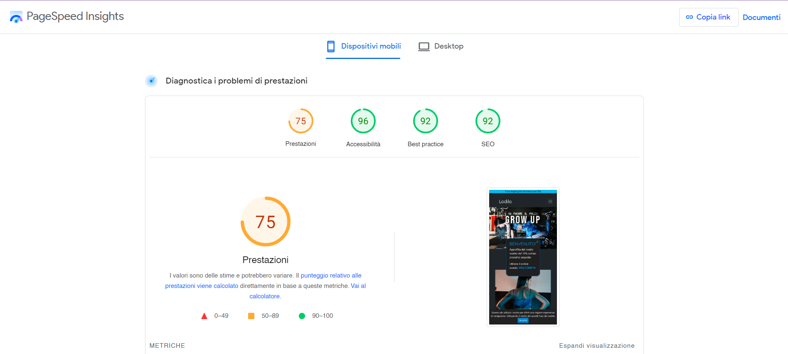

# Progetto e-commerce "Lodilo" 
Leggins sportivi e altro

**Ludovica Dimitri** 
n° _matricola:832_
Immagine d'impresa
ACME - 3°anno A.A. 2022-2023
**Materia**:Web Design 2
**Docente**:Matteo Baccan

<!-- _paginate: true -->
<!-- _footer: "" -->
<!-- style: "
img[alt~='center'] {
  display: block;
  margin: 0 auto;
}
" -->

---

## Corso di Web Design

## Lodilo

Nel corso di quest'anno abbiamo creato un sito per un ipotetico e-commerce. Io ho scelto di progettare un e-commerce di leggins sportivi, utilizzando le **competenze** acquisite in precedenza su **HTML, CSS e Javascript**.

il repository per il sito è il seguente: <https://ecommercelodilo.netlify.app/>

---

# Creazione Slide

Marp conosciuto anche come _Markdown Presentation Ecosystem_ permette un'esperienza intuitiva e veloce per creare delle semplici slide. Quello che noi dobbiamo fare è semplicemente scrivere un documento in **markdown**.

---

# Strumento per la programmazione

Per programmare ed editare le varie parti del mio sito mi sono affidata a **Codespace** lo spazio dedicato alla gestione dei codici e delle varie pagine del sito in HTML, CSS e Javascript. Il tutto all'interno di **Github**, il servizio di hosting per i vari commit e repository dei propri progetti.

---

# Bootstrap

Bootstrap è un framework di sviluppo web gratuito e open source. È progettato per facilitare il processo di sviluppo web di siti web responsive e mobile-first fornendo una raccolta di sintassi per i modelli di progettazione. Durante la progettazione è stato utilizzato per ricavare gli elementi fondamentali, come **Navbar**, **Footer**, **Card**, **Carousel** e per gestire alcuni spazi con la classificazione dello spacing dei margini.

---

# AI e Chat GPT

Chat GPT è un software di intelligenza artificiale che si concentra sull'interazione tra computer e linguaggio umano e nel mio sito l'ho utilizzato solamente in 2 casi per vedere come funzionava: per il **Welcome Popup** e per il **cookie della privacy**.

---

# Font Awesome

Per le icone presenti nel sito mi sono affidata ad un tool esterno, quale Font-Awesome che contiene milioni di icone utilizzabili anche gratuitamente.

---

# Il sito "Lodilo"
## Home Page

Il sito è stato pensato a tema Dark.

Nella Homepage troviamo diverse sezioni: 
**-Navbar**
**-Slider**
**-Card**
**-Form per il Login**
**-Footer**
**-Cookie e Welcome Popup**

---

# Navbar
La Navbar utilizzata è uno dei modelli di Bootstrap, è costituita da diversi Nav-items tra cui: Navbar-Brand(Logo), nav-item, dropdown menu, nav-link, carrello e il button per cercare. 

---

# Slider
Lo slider è stato creato con il tag carousel di Bootstrap e contiene tre diverse immagini con descrizione che possono essere cambiate al click della freccia > avanti, < indietro

---

 

---
# Card

---
# Card
Queste 3 card contengono le informazioni di un prodotto. Le card sono organizzate all'interno di una riga (`
`) che contiene elementi col (`
`) per la disposizione a tre colonne su dispositivi di dimensioni medio-grandi (`md`).
Ogni card rappresenta un prodotto e ha una struttura simile con le seguenti parti:
1. Un contenitore principale con la classe `card` e `h-100`, che definisce uno stile per la card e imposta l'altezza della card al 100% dell'altezza del contenitore.
2. All'interno della card, c'è un link (`<a>`) che circonda un'immagine (``) rappresentante il prodotto. L'immagine viene mostrata con una larghezza proporzionale tramite l'attributo `style="aspect-ratio: auto X / Y;"`, dove `X` e `Y` sono le dimensioni dell'immagine in pixel.

---

3. Dopo l'immagine, c'è un contenitore (`
`) che contiene il titolo del prodotto (`<h5 class="card-title">`), una breve descrizione (`
`) e il prezzo (`
<strong>Prezzo:</strong> €59,99
`).
4. Infine, c'è un pulsante "Aggiungi al carrello" (`<a href="#" class="btn btn-outline-light">`) con l'attributo `onclick="addtocart(N)"`, dove `N` rappresenta un numero associato al prodotto (0 per il primo prodotto, 1 per il secondo). Questo pulsante è progettato per aggiungere il prodotto al carrello quando viene cliccato, ma l'azione specifica dell'aggiunta deve essere definita in una funzione JavaScript chiamata `addtocart()`.

---

Inoltre, entrambe le card hanno uno stile di sfondo colore scuro (#212529) e testo bianco (color: white) per creare un aspetto uniforme. Il layout è centrato orizzontalmente sulla pagina utilizzando le classi `mx-auto` e `container`.

Da notare che il codice fa riferimento a immagini e link specifici (`href="prodotto.html"` e `href="prodotto2.html"`), che presumibilmente puntano a pagine specifiche dei prodotti. Inoltre, la funzione `addtocart()` è definita in qualche altro punto del codice o di un file JavaScript esterno per gestire l'aggiunta dei prodotti al carrello.

---
# Form per Login
Questo codice rappresenta una pagina di registrazione (sign-up) con un formulario HTML. Ecco una descrizione dettagliata dei principali elementi presenti nel codice:

-`
`: è una sezione contenente tutto il contenuto della pagina di registrazione.
-`
`: Questa è una sezione contenente il contenuto principale del formulario di registrazione.
-`
`: Questo è un lato del formulario contenente un'immagine (``) e alcuni elementi testuali di presentazione.

---
-`<form class="form-detail" action="#" method="post" id="myform">`: Questo è il formulario di registrazione con alcuni campi per l'inserimento dei dati.

   - `
`: Questa è una riga del formulario che contiene una coppia di etichetta (`<label>`) e campo di input (`<input>`).

Questo codice rappresenta quindi una pagina di registrazione con campi per inserire un nome utente, un'email, una password e una conferma della password, oltre a un pulsante per registrarsi e un link per accedere alla pagina di login.

---

---
# Footer
Questo codice rappresenta la struttura di un footer (piede di pagina) per una pagina web. Il footer è diviso in diverse sezioni 

---
1. `<footer class="text-center text-lg-start bg-dark" style="color:#0dcaf0">`: È una sezione (`<footer>`) con le classi `text-center` e `text-lg-start`, che definiscono l'allineamento del testo al centro (su dispositivi di dimensioni inferiori a `lg`, ovvero larghezza <= 992px) e all'inizio della riga (su dispositivi di dimensioni `lg` e superiori), rispettivamente. Lo sfondo del footer è impostato su colore scuro (#212529) con il testo in un colore azzurro chiaro (#0dcaf0).
2. Sezione "Social media": Ci sono icone dei social media (`<i>`), ciascuna avvolta da un link (`<a>`) senza un URL specificato (`href=""`). Questo significa che i collegamenti ai social media devono essere aggiunti agli attributi `href` dei link.
3. Sezione "Links": Questa sezione contiene collegamenti ad altre pagine del sito.
4. Sezione "Contatti": Questa sezione contiene informazioni di contatto per il sito.
5. Footer "Copyright": contiene un testo che indica il copyright dell'anno 2023 e un link (`<a>`) che porta al sito (`href="https://ecommercelodilo.netlify.app/"`). Il testo è impostato in grassetto (`fw-bold`) per evidenziarlo.

---
# Welcome Popup
Il popup di benvenuto offre uno sconto del 10% sul prossimo acquisto. Include un messaggio di benvenuto, le istruzioni per utilizzare il codice sconto e un'icona di chiusura per chiudere il popup. Il popup è gestito tramite il codice JavaScript, che mostra e nasconde il popup a seconda dell'interazione dell'utente con l'icona di chiusura o tramite altre azioni specificate nell'applicazione web.

---

---
#Cookie

Questo codice è uno script JavaScript per gestire l'accettazione dei cookie da parte dell'utente utilizzando i cookie del browser.

---

Il codice gestisce il banner dei cookie sulla pagina web. Se l'utente non ha ancora accettato i cookie, il banner verrà mostrato. Se l'utente accetta i cookie, il banner verrà nascosto e verrà impostato un cookie chiamato 'cookieAccepted' per tener traccia dell'accettazione. Questo approccio garantisce che il banner non venga mostrato agli utenti che hanno già accettato i cookie e vogliono nasconderlo in futuro.

---

# "Chi siamo"

La pagina Chi siamo è suddivisa in 3 sezioni: 
- Sezione "Chi siamo": Questa sezione descrive l'identità del sito "Lodilo.com" e cosa offrono. Contiene una descrizione testuale, un'immagine e un'icona.

- Sezione "Cosa facciamo": In questa sezione, il sito spiega cosa fa e come opera. Anche questa sezione contiene una descrizione testuale, un'immagine e un'icona.

- Sezione "Servizio clienti": Questa sezione mette in evidenza l'attenzione del sito verso il servizio clienti. Include una descrizione testuale, un'immagine e un'icona.

Sono stati utilizzati stili inline (come style="...") per definire alcune proprietà CSS specifiche per i contenuti, come il colore del testo, l'ombreggiatura del testo (text-shadow), la dimensione dell'icona (font-size), ecc.

---

---

# Pagine Prodotto
Il codice inserito rappresenta una sezione della pagina web con informazioni riguardanti un prodotto specifico chiamato "Completo Elettra" con una galleria di immagini, informazioni sul prodotto e pulsanti per selezionare la quantità, la taglia e il colore del prodotto, oltre a un pulsante per aggiungerlo al carrello. 
Lo style è descritto in un foglio esterno.

---

## Elementi particolari:
- 
: Questo div contiene un carosello (swiper) di immagini associate al prodotto. È utilizzato per visualizzare più immagini del prodotto, permettendo all'utente di scorrerle.
- <input type="number" class="form-control" id="quantita" min="1" value="1">: Questo è un campo di input numerico che permette all'utente di specificare la quantità desiderata del prodotto.
- <a class="btn btn-primary" id="car" style="color:white;" href="carrello.html" onclick="addtocart(0)">Aggiungi al carrello</a>: Questo è un pulsante "Aggiungi al carrello". Quando viene cliccato, viene chiamata la funzione JavaScript addtocart(0) (che sembra non essere definita nel codice fornito) e reindirizza l'utente alla pagina "carrello.html".

---

# Contatti

---
Questo pagina rappresenta un modulo di contatto e informazioni di contatto per consentire agli utenti di contattare l'azienda. Il modulo richiede nome, email e messaggio, e un pulsante consente di inviare il messaggio. Le informazioni di contatto dell'azienda sono fornite sopra il modulo.

- Gli `<li>` elementi nell'elenco contengono le informazioni di contatto, tra cui l'indirizzo, il numero di telefono e il sito web dell'azienda.

- Il `<form>` contiene un modulo di contatto con campi per nome, email e messaggio.

- Il modulo di contatto ha un pulsante "Send Message" per inviare il messaggio, utilizzando una classe "btn btn-outline-light" per lo stile del pulsante.

---

# Carrello e Mini carrello
La Pagina rappresenta una pagina web con un layout responsivo che include un carrello della spesa. Inoltre, è presente un elenco di prodotti con un'opzione per aggiungere i prodotti al carrello e visualizzarli nel carrello.
Lo stile CSS è interno; c'è il carrello della spesa: Un'icona di carrello con un contatore per il numero di articoli presenti nel carrello. È possibile fare clic sull'icona per visualizzare un elenco di prodotti nel carrello, con la possibilità di rimuoverli.
Per l'elenco dei prodotti viene fornita un'array di oggetti "product" che rappresentano i prodotti disponibili. Per ogni prodotto, è possibile visualizzare un'immagine, il titolo e il prezzo. È possibile aggiungere i prodotti al carrello facendo clic sull'icona del carrello accanto a ciascun prodotto.
Script JavaScript: Viene fornito un codice JavaScript per gestire l'aggiunta e la rimozione dei prodotti dal carrello, nonché per visualizzare l'elenco dei prodotti nel carrello e calcolare il totale dei prezzi.

---

---
# Script 
Il codice JavaScript utilizzato gestisce le funzionalità del carrello della spesa.
1. **Dati dei prodotti**: Viene definito un array chiamato "product" che contiene oggetti che rappresentano i prodotti disponibili nel negozio. Ogni oggetto ha un id univoco, un'immagine, un titolo e un prezzo.

2. **Variabile "cart"**: Viene creata una variabile "cart" in cui vengono memorizzati i prodotti aggiunti al carrello. Se non ci sono elementi nel carrello (nel caso in cui sia la prima visita dell'utente o il carrello sia stato svuotato), la variabile "cart" viene inizializzata come un array vuoto.

---

3. **Funzione "addtocart"**: Questa funzione viene chiamata quando l'utente aggiunge un prodotto al carrello. Prende come argomento l'indice dell'oggetto selezionato dal menu dei prodotti. L'oggetto viene copiato in "cart" utilizzando l'operatore spread (...) e viene aggiunto all'array "cart". Il carrello aggiornato viene quindi salvato nel local storage e la funzione "displaycart" viene chiamata per visualizzare gli elementi nel carrello.

4. **Funzione "delElement"**: Questa funzione viene chiamata quando l'utente rimuove un prodotto dal carrello. Prende come argomento l'indice dell'oggetto da rimuovere dall'array "cart". L'oggetto corrispondente viene rimosso dall'array "cart", e il carrello aggiornato viene salvato nel local storage. Infine, la funzione "displaycart" viene chiamata per aggiornare la visualizzazione del carrello.

---

5. **Funzione "displaycart"**: Questa funzione viene chiamata per visualizzare gli elementi presenti nel carrello. Conta il numero di prodotti nel carrello e aggiorna il contatore visualizzato nell'icona del carrello. Se il carrello è vuoto, vengono visualizzati messaggi appropriati; altrimenti, vengono elencati tutti i prodotti con le rispettive immagini, titoli e prezzi. Viene calcolato il totale dei prezzi dei prodotti nel carrello e visualizzato in una sezione dedicata.

Inoltre, viene chiamata la funzione "displaycart" al momento del caricamento della pagina per visualizzare eventuali prodotti già presenti nel carrello dal precedente accesso dell'utente.

---
# Responsive
https://ui.dev/amiresponsive?url=https://ecommercelodilo.netlify.app/

---
# Ottimizzazione

 

---

# Ottimizzazione Mobile

---

# Grazie per l'attenzione!

Ludovica Dimitri