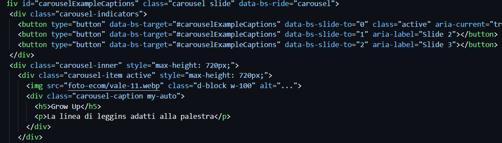
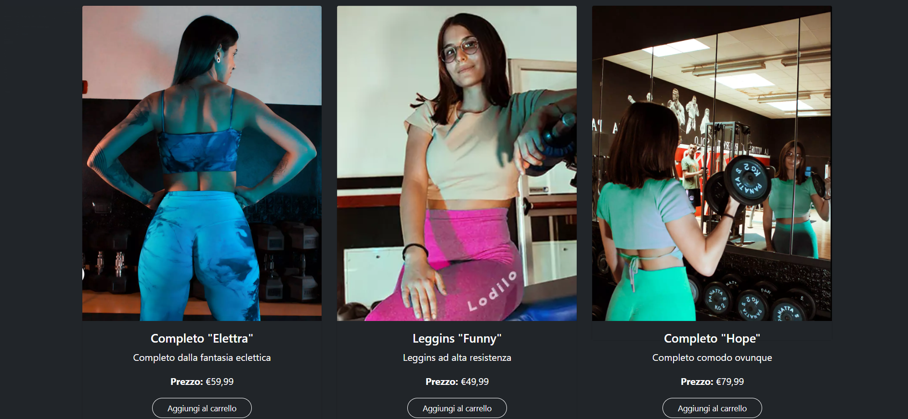
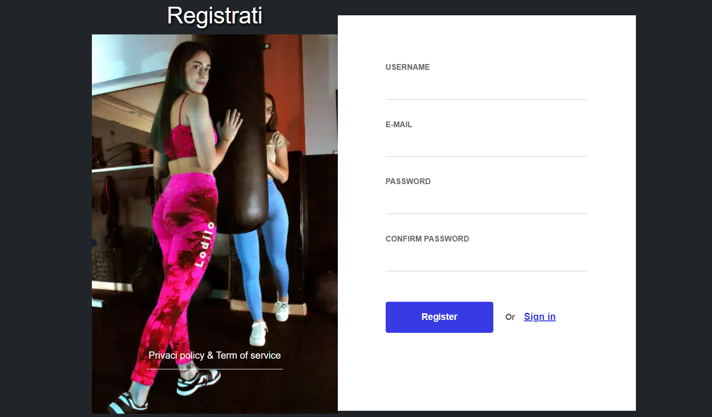
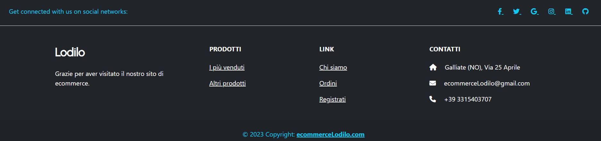

# Progetto e-commerce "Lodilo" 
Leggins sportivi e altro

**Ludovica Dimitri** 
n° _matricola:832_
Immagine d'impresa
ACME - 3°anno A.A. 2022-2023
**Materia**:Web Design 2
**Docente**:Matteo Baccan

<!-- _paginate: true -->
<!-- _footer: "" -->
<!-- style: "
img[alt~='center'] {
  display: block;
  margin: 0 auto;
}
" -->

---

## Corso di Web Design

## Lodilo

Nel corso di quest'anno abbiamo creato un sito per un ipotetico e-commerce. Io ho scelto di progettare un e-commerce di leggins sportivi, utilizzando le **competenze** acquisite in precedenza su **HTML, CSS e Javascript**.

il repository per il sito è il seguente: <https://ecommercelodilo.netlify.app/>

---

# Creazione Slide

Marp conosciuto anche come _Markdown Presentation Ecosystem_ permette un'esperienza intuitiva e veloce per creare delle semplici slide. Quello che noi dobbiamo fare è semplicemente scrivere un documento in **markdown**.

---

# Strumento per la programmazione

Per programmare ed editare le varie parti del mio sito mi sono affidata a **Codespace** lo spazio dedicato alla gestione dei codici e delle varie pagine del sito in HTML, CSS e Javascript. Il tutto all'interno di **Github**, il servizio di hosting per i vari commit e repository dei propri progetti.

---

# Bootstrap

Bootstrap è un framework di sviluppo web gratuito e open source. È progettato per facilitare il processo di sviluppo web di siti web responsive e mobile-first fornendo una raccolta di sintassi per i modelli di progettazione. Durante la progettazione è stato utilizzato per ricavare gli elementi fondamentali, come **Navbar**, **Footer**, **Card**, **Carousel** e per gestire alcuni spazi con la classificazione dello spacing dei margini.

---

# AI e Chat GPT

Chat GPT è un software di intelligenza artificiale che si concentra sull'interazione tra computer e linguaggio umano e nel mio sito l'ho utilizzato solamente in 2 casi per vedere come funzionava: per il **Welcome Popup** e per il **cookie della privacy**.

---

# Font Awesome

Per le icone presenti nel sito mi sono affidata ad un tool esterno, quale Font-Awesome che contiene milioni di icone utilizzabili anche gratuitamente.

---

# Il sito "Lodilo"
## Home Page

Il sito è stato pensato a tema Dark.

Nella Homepage troviamo diverse sezioni: 
**-Navbar**
**-Slider**
**-Card**
**-Form per il Login**
**-Footer**
**-Cookie e Welcome Popup**

---

# Navbar
La Navbar utilizzata è uno dei modelli di Bootstrap, è costituita da diversi Nav-items tra cui: Navbar-Brand(Logo), nav-item, dropdown menu, nav-link, carrello e il button per cercare. 

---

# Slider
Lo slider è stato creato con il tag carousel di Bootstrap e contiene tre diverse immagini con descrizione che possono essere cambiate al click della freccia > avanti, < indietro

---

 

---
# Card

---
# Card
Queste 3 card contengono le informazioni di un prodotto. Le card sono organizzate all'interno di una riga (`
`) che contiene elementi col (`
`) per la disposizione a tre colonne su dispositivi di dimensioni medio-grandi (`md`).
Ogni card rappresenta un prodotto e ha una struttura simile con le seguenti parti:
1. Un contenitore principale con la classe `card` e `h-100`, che definisce uno stile per la card e imposta l'altezza della card al 100% dell'altezza del contenitore.
2. All'interno della card, c'è un link (`<a>`) che circonda un'immagine (``) rappresentante il prodotto. L'immagine viene mostrata con una larghezza proporzionale tramite l'attributo `style="aspect-ratio: auto X / Y;"`, dove `X` e `Y` sono le dimensioni dell'immagine in pixel.

---

3. Dopo l'immagine, c'è un contenitore (`
`) che contiene il titolo del prodotto (`<h5 class="card-title">`), una breve descrizione (`
`) e il prezzo (`
<strong>Prezzo:</strong> €59,99
`).
4. Infine, c'è un pulsante "Aggiungi al carrello" (`<a href="#" class="btn btn-outline-light">`) con l'attributo `onclick="addtocart(N)"`, dove `N` rappresenta un numero associato al prodotto (0 per il primo prodotto, 1 per il secondo). Questo pulsante è progettato per aggiungere il prodotto al carrello quando viene cliccato, ma l'azione specifica dell'aggiunta deve essere definita in una funzione JavaScript chiamata `addtocart()`.

---

Inoltre, entrambe le card hanno uno stile di sfondo colore scuro (#212529) e testo bianco (color: white) per creare un aspetto uniforme. Il layout è centrato orizzontalmente sulla pagina utilizzando le classi `mx-auto` e `container`.

Da notare che il codice fa riferimento a immagini e link specifici (`href="prodotto.html"` e `href="prodotto2.html"`), che presumibilmente puntano a pagine specifiche dei prodotti. Inoltre, la funzione `addtocart()` è definita in qualche altro punto del codice o di un file JavaScript esterno per gestire l'aggiunta dei prodotti al carrello.

---
# Form per Login
Questo codice rappresenta una pagina di registrazione (sign-up) con un formulario HTML. Ecco una descrizione dettagliata dei principali elementi presenti nel codice:

-`
`: è una sezione contenente tutto il contenuto della pagina di registrazione.
-`
`: Questa è una sezione contenente il contenuto principale del formulario di registrazione.
-`
`: Questo è un lato del formulario contenente un'immagine (``) e alcuni elementi testuali di presentazione.

---
-`<form class="form-detail" action="#" method="post" id="myform">`: Questo è il formulario di registrazione con alcuni campi per l'inserimento dei dati.

   - `
`: Questa è una riga del formulario che contiene una coppia di etichetta (`<label>`) e campo di input (`<input>`).

Questo codice rappresenta quindi una pagina di registrazione con campi per inserire un nome utente, un'email, una password e una conferma della password, oltre a un pulsante per registrarsi e un link per accedere alla pagina di login.

---

---
# Footer
Questo codice rappresenta la struttura di un footer (piede di pagina) per una pagina web. Il footer è diviso in diverse sezioni 

---
1. `<footer class="text-center text-lg-start bg-dark" style="color:#0dcaf0">`: È una sezione (`<footer>`) con le classi `text-center` e `text-lg-start`, che definiscono l'allineamento del testo al centro (su dispositivi di dimensioni inferiori a `lg`, ovvero larghezza <= 992px) e all'inizio della riga (su dispositivi di dimensioni `lg` e superiori), rispettivamente. Lo sfondo del footer è impostato su colore scuro (#212529) con il testo in un colore azzurro chiaro (#0dcaf0).
2. Sezione "Social media": Ci sono icone dei social media (`<i>`), ciascuna avvolta da un link (`<a>`) senza un URL specificato (`href=""`). Questo significa che i collegamenti ai social media devono essere aggiunti agli attributi `href` dei link.
3. Sezione "Links": Questa sezione contiene collegamenti ad altre pagine del sito.
4. Sezione "Contatti": Questa sezione contiene informazioni di contatto per il sito.
5. Footer "Copyright": contiene un testo che indica il copyright dell'anno 2023 e un link (`<a>`) che porta al sito (`href="https://ecommercelodilo.netlify.app/"`). Il testo è impostato in grassetto (`fw-bold`) per evidenziarlo.