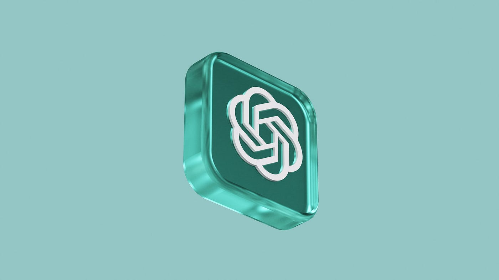
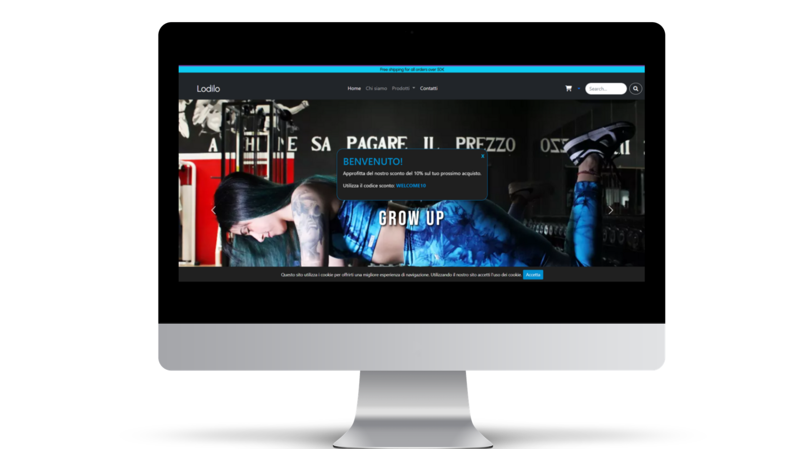
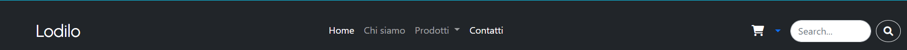

# Progetto e-commerce "Lodilo" 
Leggins sportivi e altro

**Ludovica Dimitri** 
n° _matricola:832_
Immagine d'impresa
ACME - 3°anno A.A. 2022-2023
**Materia**:Web Design 2
**Docente**:Matteo Baccan

<!-- _paginate: true -->
<!-- _footer: "" -->
<!-- style: "
img[alt~='center'] {
  display: block;
  margin: 0 auto;
}
" -->

---

## Corso di Web Design

## Lodilo

Nel corso di quest'anno abbiamo creato un sito per un ipotetico e-commerce. Io ho scelto di progettare un e-commerce di leggins sportivi, utilizzando le **competenze** acquisite in precedenza su **HTML, CSS e Javascript**.

il repository per il sito è il seguente: <https://ecommercelodilo.netlify.app/>

---

# Creazione Slide

Marp conosciuto anche come _Markdown Presentation Ecosystem_ permette un'esperienza intuitiva e veloce per creare delle semplici slide. Quello che noi dobbiamo fare è semplicemente scrivere un documento in **markdown**.

---

# Strumento per la programmazione

Per programmare ed editare le varie parti del mio sito mi sono affidata a **Codespace** lo spazio dedicato alla gestione dei codici e delle varie pagine del sito in HTML, CSS e Javascript. Il tutto all'interno di **Github**, il servizio di hosting per i vari commit e repository dei propri progetti.

---

# Bootstrap

Bootstrap è un framework di sviluppo web gratuito e open source. È progettato per facilitare il processo di sviluppo web di siti web responsive e mobile-first fornendo una raccolta di sintassi per i modelli di progettazione. Durante la progettazione è stato utilizzato per ricavare gli elementi fondamentali, come **Navbar**, **Footer**, **Card**, **Carousel** e per gestire alcuni spazi con la classificazione dello spacing dei margini.

---

# AI e Chat GPT

Chat GPT è un software di intelligenza artificiale che si concentra sull'interazione tra computer e linguaggio umano e nel mio sito l'ho utilizzato solamente in 2 casi per vedere come funzionava: per il **Welcome Popup** e per il **cookie della privacy**.

---

# Font Awesome

Per le icone presenti nel sito mi sono affidata ad un tool esterno, quale Font-Awesome che contiene milioni di icone utilizzabili anche gratuitamente.

---

# Il sito "Lodilo"
## Home Page

Il sito è stato pensato a tema Dark.

Nella Homepage troviamo diverse sezioni: 
**-Navbar**
**-Slider**
**-Card**
**-Form per il Login**
**-Footer**
**-Cookie e Welcome Popup**

---

# Navbar
La Navbar utilizzata è uno dei modelli di Bootstrap, è costituita da diversi Nav-items tra cui: Navbar-Brand(Logo), nav-item, dropdown menu, nav-link, carrello e il button per cercare. 

